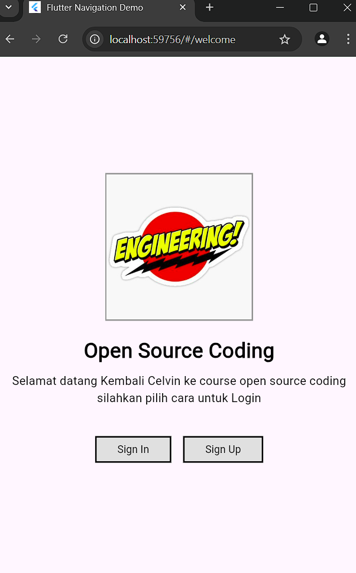
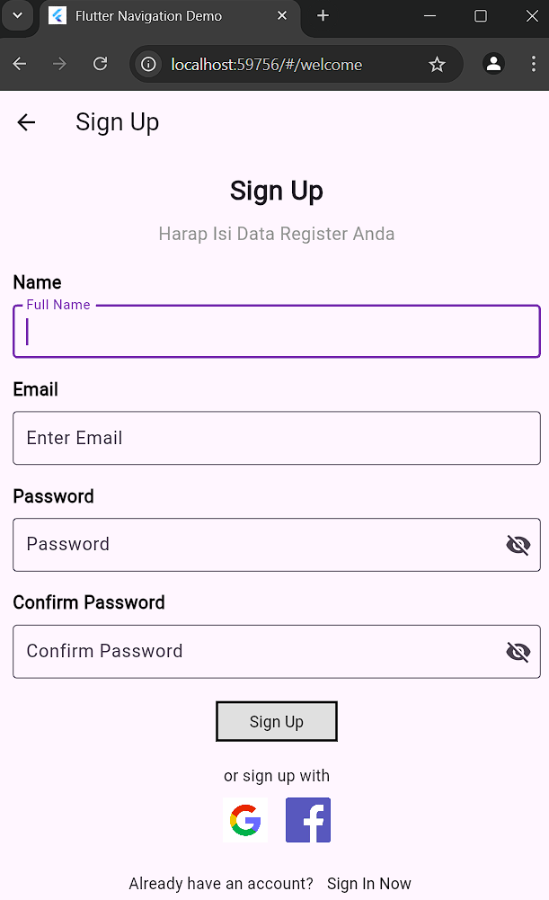
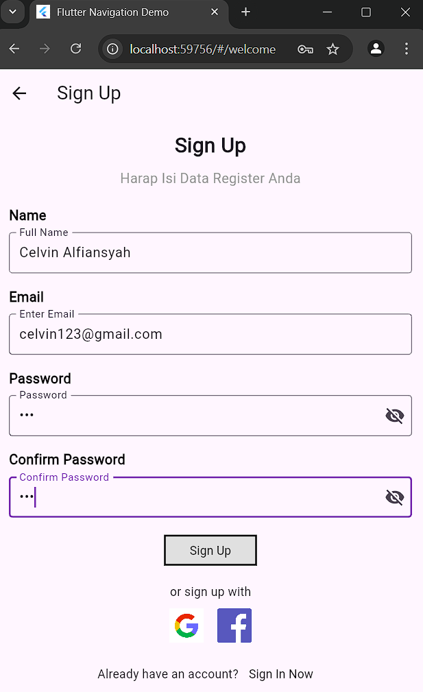

# UJIAN PRAKTIKUM

## Nama  : Celvin Alfiansyah
## Nim   : 362358302104
## Kelas : 2D TRPL

# Screen 1

page pertama ialah welcome_screen yang berisikan sign in dan sign up button

# Screen 2

page kedua ialah sign up screen yang haruskan mengisi data agar bisa sign in

gambaran setelah mengisi data

# Screen 3

yang selanjutnya page ketiga ialah sign in, setelah mengisi data pada sign up harap mengisi data yang ada pada sign in

ini adalah gambar jika tidak ada data yang dimasukkan

pastikan data yang diisi sudah benar dan anda akan diarahkan ke dashboard screen

# Screen 4

ini ialah dashboard screen jika dipencet tombol message pada dibawah maka akan diarahkan ke halaman message

setelah memencet message akan diarahkan kesini, data yang berisi disini ada pada lib/assets/data/datamessage.json lalu kita akan beralih ke profil dengan memencet tombol profile yang ada dibawah

ini adalah tombol profile kita akan scroll kebawah

jika memencet tulisan "Log Out" maka anda akan dialihkan pada welcome screen yang pertama tadi.

